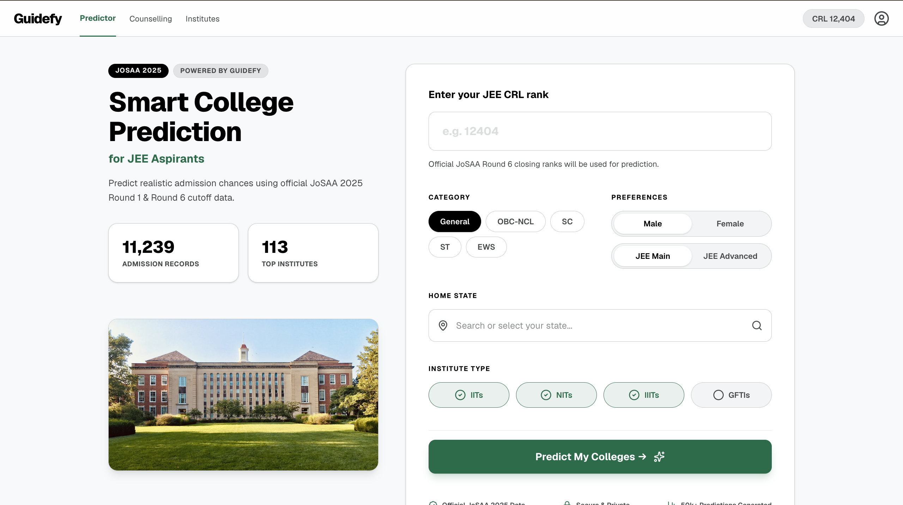
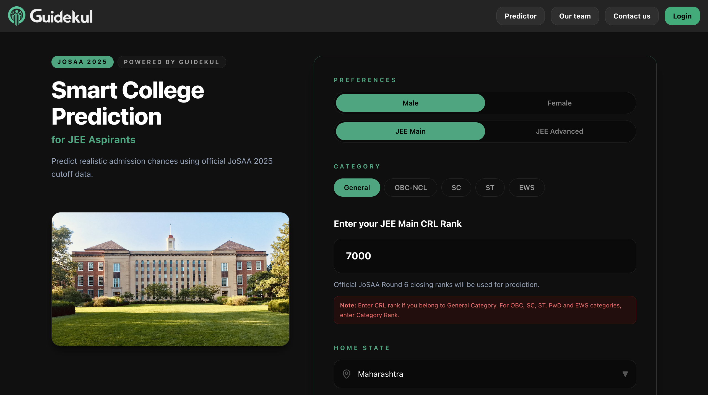
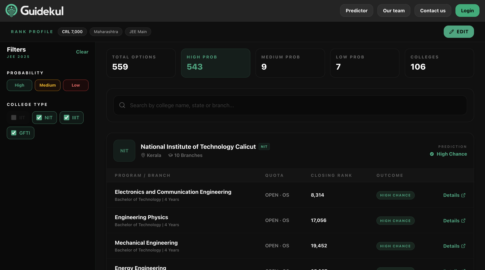

# 👋 Welcome to Vision CSE  

This repository is for the **15 Days of Code Challenge** organized by **Vision CSE** 🚀  

## 📌 About the Challenge
- Duration: **2 phases of 15 Days**
- Goal: Code every day and build consistency  
- Task: Fork this repository, and update your progress here!  

## ✅ How to Participate
1. **Fork** this repository.  
2. **Edit this README** file in your fork.  
3. Document your progress daily:  
   - Add a short note on what you did  
   - Attach screenshots or  
   - Add links to your code submissions/projects  

4. Keep pushing your changes every day!  

----

# DAY1-11th May

1) Completed C++ tutorial [Link](https://youtu.be/e7sAf4SbS_g?si=F8eg4PXF0jiwRrM5)
2) Solved LeetCode Problem 1 [Question](https://leetcode.com/problems/two-sum/description/) [Solution](https://leetcode.com/submissions/detail/2000745553/)
3) Working on a JEE college predictor - Extracted data and Prediction Algorithm

----

# DAY2-12th May

1) Didn't code much as i went outside due to some important work will cover this on day 16th, did revision of some webd topics.
2) Worked on college predictor project.
3) completed c++ patterns

----

# DAY3-13th May

1) Compeleted C++ STL pairs, vectors, end and reverse, list, dq, queue, priority, set, multiset, unordered set, map, multimap [Link](https://youtu.be/RRVYpIET_RU?si=Ipxx43E__rg-h8RB)
2) figuring out how can we cover such a big data of jossa like storing it in database as csv or converting it into json for comparitively fast fetching.
3) Started with basics of system desgin. 

----

# DAY4-14th May

1) Solved some basic math questions on lc and gfg
Reverse Integer
[Problem](https://leetcode.com/problems/reverse-integer/)
[Solution](https://leetcode.com/submissions/detail/2002727941/)

2) Palindrome Number
[Problem](https://leetcode.com/problems/palindrome-number/description/)
[Solution](https://leetcode.com/submissions/detail/2002777381/)

3) Count Digits in a Number
[Solution] In Day4 folder
[Problem](https://www.geeksforgeeks.org/problems/count-total-digits-in-a-number/1)

4) Armstrong Numbers
[Solution] In Day4 folder
[Problem](https://www.geeksforgeeks.org/problems/armstrong-numbers2727/1)

5) All divisors of a Number
[Solution] In Day4 folder
[Problem](https://www.geeksforgeeks.org/problems/all-divisors-of-a-number/1)

6) Prime Number
[Solution] In Day4 folder
[Problem](https://www.geeksforgeeks.org/problems/prime-number2314/1)

7) GCD of two numbers
[Solution] In Day4 folder
[Problem](https://www.geeksforgeeks.org/problems/gcd-of-two-numbers3459/1)

8) Working on a new project 

----

# DAY5-15th May

1) Did recursion 5 lectures from striver's playlist covering some basic recursion problems, parameterised and functional recursion, multiple recursion calls.

2) Power of Two
[Problem](https://leetcode.com/problems/power-of-two/)
[Solution](https://leetcode.com/submissions/detail/2004036188/)

3) Fibonacci Number
f(n) = f(n-1) + f(n-2)
[Problem](https://leetcode.com/problems/fibonacci-number/description/)
[Solution](https://leetcode.com/submissions/detail/2004092283/)

----
 
# DAY6-16th May

1) Learned about Recursion on Subsequences
2) solved an lc problem [Solution](https://leetcode.com/submissions/detail/2004809525/)
3) learned about zod validation in next.js

----

# DAY7-17th May

1) Learned about Recursion - Printing subsequences whose sum is k. 

2) Solved - Frequency of the Most Frequent Element   
[Solution](https://leetcode.com/submissions/detail/2005800023/)

3) Done with Basic Hashing and important Sorting Techniques such Selection Sort, Bubble Sort, Insertion Sort.

4) worked on college predictor project

----

# DAY8-18th May

1) Done with merge sort

2) Solved - Find Words That Can Be Formed by Characters   
[Solution](https://leetcode.com/submissions/detail/2006653840/)

3) Started with Arrays - largest,second largest elements

4) worked on college predictor project

----

# DAY9-20th May

on 19th may i went outside because of some important work didn't code much on that day so compiled it with 20th may   
1) Did arrays striver's lecture and solved those problems of  
Check if the Array is Sorted
, Remove Duplicates from Sorted Array
, Left Rotate Array by One
, Left Rotate Array by K Places
, Move Zeros to End
, Linear Search
, Union of Two Sorted Arrays

2) Problem - Remove Duplicates from Sorted Array   [Solution](https://leetcode.com/submissions/detail/2007241979/)

3) Problem - Move Zeroes   [Solution](https://leetcode.com/submissions/detail/2008350107/)
 
4) some questions on gfg - https://www.geeksforgeeks.org/problems/largest-element-in-array4009/1  
https://www.geeksforgeeks.org/problems/check-if-an-array-is-sorted0701/1  
https://www.geeksforgeeks.org/problems/search-an-element-in-an-array-1587115621/1  
https://www.geeksforgeeks.org/problems/union-of-two-sorted-arrays-1587115621/1  

----

# DAY10-21st May

1) learned about how to understand a codebase from the first principles.

2) Problem - Intersection of Two Arrays   [Solution](https://leetcode.com/submissions/detail/2009306453/)

----

# DAY11-22nd May

1) building college predictor which will help students to get idea about what clg they can get according to past year jossa data
 

2) Problem - Max Consecutive Ones   [Solution](https://leetcode.com/submissions/detail/2010154262/) 

----

# DAY12-23rd May

1) Building jee college predictor, solving errors such as filtering based on category rank if applicable, filters errors ... etc

2) DSA -  
Problem - Single Number [Solution](https://leetcode.com/submissions/detail/2010662897/)
 
solved longest subarray with sum K

----

# DAY13-24th May

1) Problem - Sort Colors [Solution](https://leetcode.com/submissions/detail/2011975409/) using dutch national flag algorithm           
         0 to low-1 => 0  
         low to mid-1 => 1  
         high + 1 to n-1 => 2  
         so the section between mid to high is of unsorted 0s, 1s, and 2s we are sorting it by taking cases of mid to be 0 1 2 then swaping that mid with at low, there only, & high respectively with low++ mid++, mid++, & high-- respectively.  

2) Problem - Two Sum [Solution](https://www.geeksforgeeks.org/problems/key-pair5616/1)

3) Solving bugs of clg predictor

----

# DAY14-25th May

1) Changing theme of college predictor and almost done.

2) Problem - Majority Element [Solution](https://leetcode.com/submissions/detail/2012578401/).

----

# DAY15-26th May

1) Learning basics of NextJs, integrating college predictor in company's codebase which is in next js.

2) Problem - Maximum Subarray - Kadane's Algo [Solution](https://leetcode.com/submissions/detail/2013879467/)

3) Problem - Best Time to buy and sell stock [Solution](https://leetcode.com/submissions/detail/2013931338/)

----

# DAY16-27th May
(on day12th i went outside so for that, completed on day16th)

1) Problem - Maximum Distance in Arrays [Solution](https://leetcode.com/submissions/detail/2014859040/)  
   Problem - Rearrange Array Elements by Sign [Solution](https://leetcode.com/submissions/detail/2014891962/)

2) Compeleted JEE College Prediction tool and merged into production codebase currently live at [Guidekul College Predictor](https://www.guidekul.com/predictor)  

----
----

# 15 Days of Code Part2

----

# DAY1-16th June

1) Learned about PostgreSQ's Relationships, Joins, Transactions and started with Prisma ORMs.

2) Started with Linked List from Striver.

3) Delete Node in a Linked List   [Problem Solution](https://leetcode.com/submissions/detail/2033117696/)

4) Reverse String   [Problem Solution](https://leetcode.com/submissions/detail/2034307476/)

----

# DAY2-18th June
For 2days didn't code much as i went out

1) Completed PRISM ORM and Merged some PRs fixing a bug and chaning the navbar into much prettier one at mobile view for a startup.

2) Solved two LC questions   [Problem Solution](https://leetcode.com/submissions/detail/2035522335/)
  [Problem Solution](https://leetcode.com/submissions/detail/2036729989/)
  [Problem Solution](https://leetcode.com/submissions/detail/2037935159/)